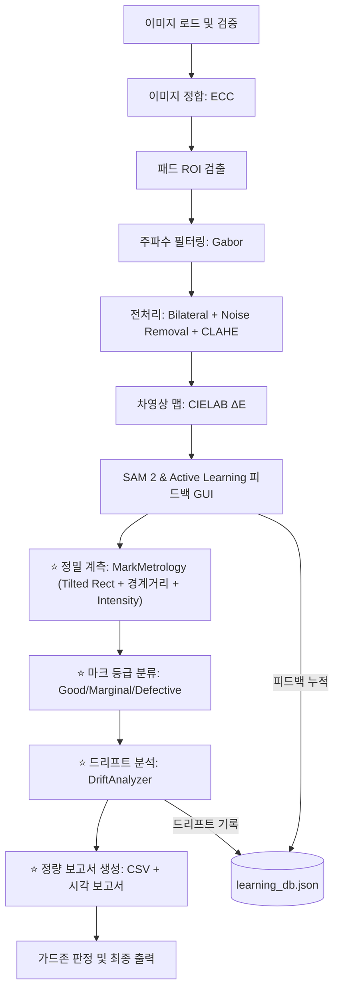

# main8.py → main9.py 산업 PMI 수준 고도화 구현 계획서

## 1. 배경: main8.py와 산업 PMI 시스템 비교 분석

### 1.1 main8.py 현재 기능 요약
| 기능 영역 | 현재 상태 |
|---|---|
| 이미지 정합 | ECC 기반 Euclidean Motion 정합 ✅ |
| 패드 ROI 검출 | Otsu + Canny 백업, 수동 4점 지정 ✅ |
| 마크 검출 | 차영상(CIELAB ΔE) + SAM 2 Point Prompt ✅ |
| 노이즈 제거 | Gabor 대역차단 + Bilateral + Erosion + 기하필터 ✅ |
| 학습 시스템 | Feature Matching + Active Learning DB ✅ |
| 가드존 판정 | 단순 PASS/FAIL (마크가 가드존 밖에 있는지) ✅ |

### 1.2 산업 PMI 시스템에서 제공하는 핵심 기능 (main8.py에 없는 것)

산업용 PMI 장비(Cognex, FormFactor, AccuProbe 등)가 제공하는 기능 중 main8.py에 **부재하거나 크게 부족한** 항목:

| # | 부재 기능 | 산업적 중요도 | 설명 |
|---|---|---|---|
| ① | **스크럽 마크 정밀 계측 (Tilted Rectangle Fitting)** | ⭐⭐⭐ | 마크의 장축/단축 길이, 스크럽 방향 각도(θ), 면적을 Tilted Bounding Box로 정밀 측정. 현재 main8은 minEnclosingCircle만 사용. |
| ② | **패드 경계 거리 측정 (Scrub Edge Distance)** | ⭐⭐⭐ | 마크 외곽에서 패드 4변(좌/우/상/하) 경계까지의 최소 안전 거리를 개별 측정하여 패시베이션 손상 위험 판단. |
| ③ | **마크 위치 드리프트 분석 (Drift / Offset Tracking)** | ⭐⭐⭐ | 다수 이미지에 걸친 마크 중심점 위치의 통계적 편차(X/Y Offset) 추적. 프로브 카드 정렬 이상이나 열팽창 감지. |
| ④ | **Overdrive 추정 (스크럽 길이 ↔ 접촉압 상관)** | ⭐⭐ | 스크럽 마크의 장축 길이로부터 프로브의 오버드라이브(초과 접촉 거리)를 역추정. |
| ⑤ | **마크 깊이/강도 추정 (Mark Intensity)** | ⭐⭐ | 마크 영역의 명도 차이(ΔL)로부터 접촉 강도/깊이를 추정. 과접촉(Punch-through) 또는 미접촉 감지. |
| ⑥ | **패시베이션 침범 검출 (Passivation Damage)** | ⭐⭐⭐ | 마크가 패드 유효 영역을 벗어나 패시베이션 층을 침범했는지 감지. |
| ⑦ | **마크 분류 체계 (Mark Classification)** | ⭐⭐ | 검출된 마크를 'Good', 'Marginal', 'Defective' 등급으로 자동 분류. |
| ⑧ | **정량 보고서 자동 생성 (Quantitative Report)** | ⭐⭐ | 스크럽 길이, 각도, 면적, 경계 거리, 판정 결과를 구조화된 보고서로 출력. |
| ⑨ | **다중 마크 개별 추적 (Multi-Mark Indexing)** | ⭐ | 패드 내 복수 마크를 개별 인덱싱하여 각각의 특성을 분리 분석. |
| ⑩ | **프로브 카드 상태 모니터링 지표 (Health Score)** | ⭐⭐ | 마크 균일도, 위치 편차, 크기 변동 등을 종합하여 프로브 카드 상태 건강도 점수를 산출. |

---

## 2. 구현 범위 결정

> [!IMPORTANT]
> 전체 10가지 중 **산업적 중요도가 높고 현재 코드 아키텍처로 구현 가능한 핵심 7가지**를 main9.py에 구현합니다.

### 구현 대상 (main9.py)
1. **스크럽 마크 정밀 계측** — `cv2.minAreaRect` 기반 Tilted Rectangle Fitting
2. **패드 경계 거리 측정** — 마크 Contour → 패드 4변 최소 거리 계산
3. **마크 위치 드리프트 분석** — DB 누적 기반 X/Y Offset 통계(평균/표준편차) 추적
4. **Overdrive 추정** — 스크럽 장축 길이 대비 패드 크기 비율 역산
5. **마크 깊이/강도 추정** — Before/After 간 마크 영역 ΔL* (CIELAB 밝기 차이)
6. **마크 분류 체계** — Good / Marginal / Defective 3등급 자동 분류
7. **정량 보고서 자동 생성** — CSV + Matplotlib 시각 요약 보고서

### 구현 제외 (필요 시 후속 구현)
- 패시베이션 침범 검출: 패시베이션 경계 정보를 별도 입력받아야 하므로 보류.
- 프로브 카드 Health Score: 충분한 누적 데이터 수집 후 구현이 적절.

---

## 3. 상세 설계

### 3.1 `MarkMetrology` 클래스 [NEW]
스크럽 마크의 정량적 계측 정보를 추출하는 핵심 엔진 클래스입니다.

```python
class MarkMetrology:
    """산업 PMI 수준의 마크 정밀 계측 엔진"""
    
    def measure_mark(self, mask, pad_rect, img_before_lab, img_after_lab):
        """
        반환: {
            # 1. Tilted Rectangle 계측
            'center': (cx, cy),         # 마크 중심좌표
            'major_axis': float,        # 장축 길이 (스크럽 길이)
            'minor_axis': float,        # 단축 길이 (스크럽 폭)
            'angle': float,             # 스크럽 방향 각도 (°)
            'area': float,              # 마크 면적 (px²)
            
            # 2. 패드 경계 거리
            'dist_left': float,         # 패드 좌측 경계까지 최소거리
            'dist_right': float,        # 패드 우측 경계까지 최소거리
            'dist_top': float,          # 패드 상단 경계까지 최소거리
            'dist_bottom': float,       # 패드 하단 경계까지 최소거리
            'min_edge_dist': float,     # 4변 중 최소 거리 (가장 위험한 측)
            
            # 3. 중심 오프셋 (패드 중심 대비)
            'offset_x': float,          # 패드 중심 대비 X 오프셋
            'offset_y': float,          # 패드 중심 대비 Y 오프셋
            
            # 4. Overdrive 추정
            'overdrive_ratio': float,   # 스크럽 장축 / 패드 폭 비율
            
            # 5. 마크 깊이/강도
            'intensity_delta_L': float, # CIELAB L* 채널 평균 차이
            
            # 6. 분류
            'grade': str,               # 'Good' / 'Marginal' / 'Defective'
            'grade_reasons': [str]       # 등급 판정 사유 리스트
        }
        """
```

**등급 분류 규칙 (Grade Classification Rules)**:

| 등급 | 조건 |
|---|---|
| **Good** | min_edge_dist > 패드 폭의 10% **AND** overdrive_ratio ∈ [0.05, 0.35] **AND** circularity > 0.25 |
| **Marginal** | min_edge_dist > 패드 폭의 3% **AND** (overdrive_ratio가 경계에 근접하거나 약간 초과) |
| **Defective** | min_edge_dist ≤ 패드 폭의 3% **OR** overdrive_ratio > 0.5 (과접촉) **OR** overdrive_ratio < 0.02 (미접촉) |

---

### 3.2 `DriftAnalyzer` 클래스 [NEW]
다수 이미지에 걸쳐 마크의 위치 편차를 누적 통계 추적하는 클래스입니다.

```python
class DriftAnalyzer:
    """마크 위치 드리프트(편차) 통계 분석기"""
    
    def __init__(self, db):
        # DB에 'drift_history' 키를 추가하여 세션별 마크 위치 기록 관리
    
    def record_session(self, roi_idx, marks_metrology_list):
        """현재 세션의 마크 계측 결과를 드리프트 히스토리에 기록"""
    
    def get_drift_stats(self, roi_idx):
        """특정 ROI의 누적 드리프트 통계 반환
        반환: {
            'mean_offset_x': float, 'mean_offset_y': float,
            'std_offset_x': float, 'std_offset_y': float,
            'trend_direction': str,  # 'stable' / 'drifting_left' / 'drifting_right' 등
            'session_count': int
        }
        """
    
    def plot_drift_chart(self, roi_idx):
        """X/Y 오프셋 산점도 + 트렌드 라인 시각화"""
```

---

### 3.3 `ReportGenerator` 클래스 [NEW]
정량 보고서를 CSV 파일과 시각적 요약 플롯으로 자동 생성합니다.

```python
class ReportGenerator:
    """PMI 정량 보고서 자동 생성기"""
    
    def generate_csv(self, roi_results, metrology_data, output_path):
        """마크별 상세 계측치를 CSV로 출력"""
    
    def generate_visual_report(self, img_before, img_after, roi_results, metrology_data):
        """6패널 종합 시각 보고서:
          [1] Before 원본   [2] After 정합 이미지
          [3] 마크 오버레이 + Tilted Rect [4] 패드 경계거리 히트맵
          [5] 등급별 색상 분류 결과      [6] 드리프트 차트
        """
```

---

### 3.4 main9.py 전체 파이프라인 [NEW]



main8.py의 모든 기존 기능(Active Learning GUI, DB 동기화, 경계 Erosion, 기하 예외 필터)은 그대로 유지하면서, 파이프라인 7/8 단계와 최종 출력 사이에 **계측 → 분류 → 드리프트 → 보고서** 4단계를 추가 삽입합니다.

---

## 4. 파일 변경 계획

### 4.1 [NEW] [main9.py](file:///c:/python/image_segmentation_260414/main9.py)
- main8.py를 기반으로 전체 코드를 복사한 후, 위의 3개 신규 클래스(`MarkMetrology`, `DriftAnalyzer`, `ReportGenerator`)를 추가.
- `run_active_learning_gui`의 반환값에 마크 계측 정보를 포함하도록 확장.
- `main()` 함수에 계측 → 분류 → 드리프트 → 보고서 파이프라인 단계를 추가.
- 최종 시각화 함수를 `visualize_pmi_report`로 고도화하여 Tilted Rectangle, 경계 거리, 등급 색상을 포함한 6패널 보고서로 교체.

### 4.2 기존 파일 변경 없음
- [processor.py](file:///c:/python/image_segmentation_260414/processor.py), [dual_roi_utils.py](file:///c:/python/image_segmentation_260414/dual_roi_utils.py), [noise_remover.py](file:///c:/python/image_segmentation_260414/noise_remover.py), [image_preprocessor.py](file:///c:/python/image_segmentation_260414/image_preprocessor.py) — 변경 없음.

---

## 5. 검증 계획

### 자동 검증
```bash
uv run python -c "import main9; print('main9.py 임포트 성공')"
```

### 기능 검증
- main9.py 실행 후 Active Learning GUI에서 마크 피드백 → 's'키 저장 → 정량 보고서 CSV 파일과 6패널 시각 보고서 정상 출력 확인.
- 마크별 Tilted Rectangle이 올바르게 오버레이되고, 장축/단축/각도/경계거리가 표기되는지 확인.
- 등급 분류(Good/Marginal/Defective)가 마크 상태에 따라 적절히 판별되는지 확인.

---

## Open Questions

> [!IMPORTANT]
> **Q1.** Overdrive 추정의 기준 비율(스크럽 장축 / 패드 폭)의 Good/Marginal/Defective 판정 임계값이 실제 사용하시는 프로브 카드 규격과 맞는지 확인 필요합니다. 현재는 일반적 산업 기준(5~35%: Good)으로 설정했습니다. 실제 규격에 맞춰 조정하시겠습니까?

> [!IMPORTANT]
> **Q2.** 드리프트 분석에서 과거 세션 데이터를 `learning_db.json`에 함께 저장할 예정인데, 별도의 `drift_db.json`으로 분리하는 것이 선호되시나요?

> [!IMPORTANT]
> **Q3.** CSV 보고서 파일명을 자동으로 `pmi_report_YYYYMMDD_HHMMSS.csv` 형태로 생성할 예정입니다. 저장 경로를 워크스페이스 루트(`c:\python\image_segmentation_260414\reports\`)로 설정해도 괜찮으시겠습니까?
