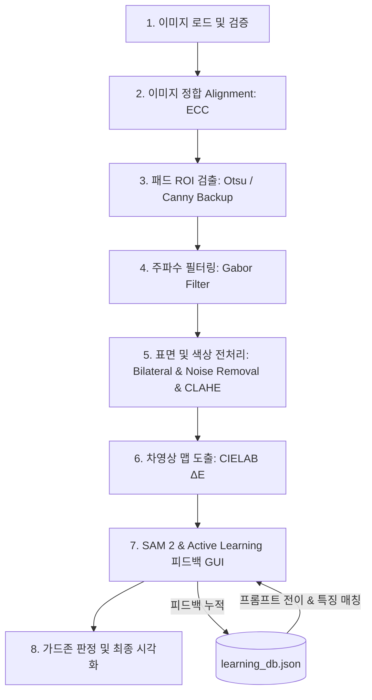
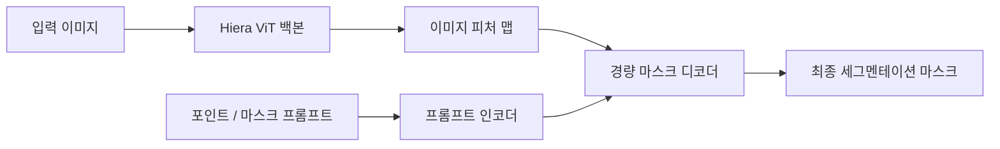

# Probe Card Contact Mark Analysis System (main8.py) 기술 가이드 및 이론 설명서

본 문서는 프로브 카드 컨택 마크(Contact Mark) 검출 및 가드존 침범 여부 판정 시스템의 최종 진화형인 `main8.py`와 그 연관 모듈들의 시스템 설계, 기술 스택 및 핵심 컴퓨터 비전/딥러닝 이론에 대하여 아주 상세하게 설명합니다.

---

## 1. 시스템 개요 및 아키텍처

본 시스템은 반도체 검사용 프로브 카드가 웨이퍼 패드에 접촉할 때 발생하는 미세한 물리적 흔적인 **컨택 마크(Contact Mark)**를 이미지 처리를 통해 정밀하게 검출하고, 해당 마크가 패드 중심 기준의 안전 영역(Guard Zone)을 벗어났는지(PASS/FAIL) 판정하는 산업용 비전 검사 프레임워크입니다.

개별 이미지의 조명 편차, 정합 오차, 표면 노이즈 등으로 발생하는 검출 실패 및 오검출 문제를 해결하기 위해, 사용자의 피드백을 실시간으로 반영하여 스스로 판별 기준을 고도화하는 **Human-in-the-Loop Active Learning** 기반의 파이프라인을 채택하고 있습니다.

### 1.1 전체 파이프라인 흐름도



---

## 2. 기술 스택 (Technology Stack)

본 시스템은 고성능 이미지 처리, 실시간 딥러닝 추론, 그리고 직관적인 사용자 상호작용 인터페이스를 제공하기 위해 다음과 같은 검증된 기술 스택을 기반으로 설계되었습니다.

1. **개발 언어**: `Python 3`
2. **패키지 및 가상환경 관리**: `uv` (가상환경 디렉토리: `.venv`)
3. **핵심 이미지 프로세싱**: `OpenCV (cv2)`
   - 고속 이미지 정합(Alignment), 이진화, 형태학적 연산(Morphology), CIELAB 색상 공간 분석, 기하학적 특징 계산 담당.
4. **고성능 수치 계산**: `NumPy`
   - 대규모 픽셀 행렬 연산 및 특징 데이터의 유사도(거리 계산) 행렬 처리 연산 가속.
5. **딥러닝 세그멘테이션**: `Segment Anything Model 2 (SAM 2)`
   - PyTorch 환경에서 동작하며, 프롬프트 기반(Point Prompt Tuning) 제로샷 분할을 수행하는 핵심 AI 모델.
   - 구성 모델 설정: `sam2.1_hiera_b+.yaml`
   - 가중치 체크포인트: `sam2.1_hiera_base_plus.pt`
6. **하드웨어 가속**: `PyTorch CUDA` 및 `TF32(TensorFloat-32) 가속`
   - GPU 사용 가능 시 `autocast` 및 `bfloat16` 데이터 타입을 활성화하여 실시간 인터랙티브 클릭 반응 속도 확보.
7. **시각화 및 사용자 가이드**: `Matplotlib`, `koreanize-matplotlib`
   - 한글 폰트 깨짐 현상을 원천 방지하고, 수동 ROI 지정 방법 등을 다이얼로그 형태로 사용자에게 먼저 예시를 제시하는 가시화 도구.
8. **데이터베이스 엔진**: `JSON 기반 파일 시스템 DB` (`learning_db.json`)
   - 경량화된 파일 DB 형태로 마크의 색상/기하 특징 벡터(Feature Profile), 노이즈 프로필 및 정합 좌표계 기준의 일반화된 프롬프트 데이터를 실시간으로 동기화 저장.

---

## 3. 핵심 영상 처리 및 컴퓨터 비전 이론

### 3.1 이미지 정합 (Image Alignment - ECC 알고리즘)
전(Before) 이미지와 후(After) 이미지를 픽셀 단위로 비교하여 변화량을 계산하기 위해서는, 미세하게 회전되거나 밀린 상태로 캡처된 두 이미지의 좌표계를 완벽히 정렬해야 합니다.

*   **ECC (Enhanced Correlation Coefficient) Maximization**:
    본 시스템은 강도(Intensity) 차이에 민감한 전통적인 SSD(Sum of Squared Differences)나 CC(Cross-Correlation) 대신, 이미지의 명암 변화에 강건하고 미세한 기하학적 정합도가 높은 ECC 알고리즘을 사용합니다.
    두 이미지 $I_1(\mathbf{x})$와 $I_2(\mathbf{W}(\mathbf{x};\mathbf{p}))$ 간의 정합을 위해 최적의 변환 파라미터 벡터 $\mathbf{p}$를 아래 식을 최대화하는 방향으로 반복(Iteration) 도출합니다.
    $$\rho(\mathbf{p}) = \frac{\sum_{\mathbf{x}} [I_1(\mathbf{x}) - \bar{I}_1] \cdot [I_2(\mathbf{W}(\mathbf{x};\mathbf{p})) - \bar{I}_2(\mathbf{p})]}{\sqrt{\sum_{\mathbf{x}} [I_1(\mathbf{x}) - \bar{I}_1]^2} \sqrt{\sum_{\mathbf{x}} [I_2(\mathbf{W}(\mathbf{x};\mathbf{p})) - \bar{I}_2(\mathbf{p})]^2}}$$
    여기서 $\mathbf{W}(\mathbf{x};\mathbf{p})$는 기하학적 변환 관계를 매핑하는 Warp 행렬이며, 본 시스템은 회전과 평행 이동을 포함하는 2D 유사 변환(Euclidean Motion, 3자유도)인 `cv2.MOTION_EUCLIDEAN`을 적용합니다.

### 3.2 Gabor Filter 기반 주파수 대역 차단 필터링
웨이퍼 패드 표면의 미세하고 주기적인 머시닝 패턴(그레인 텍스처)은 조명의 각도에 따라 차영상에서 큰 오검출 노이즈를 유발합니다. 특정 방향성과 주파수를 가진 성분을 차단하기 위해 Gabor Filter를 주파수 공간에서 적용합니다.

*   **Gabor Kernel의 수학적 정의**:
    공간 영역에서의 Gabor 커널은 다음과 같이 가우시안 포락선(Gaussian Envelope)과 사인파 평면파(Sinusoidal Plane Wave)의 곱으로 정의됩니다.
    $$g(x, y; \theta, \lambda, \psi, \sigma, \gamma) = \exp \left( -\frac{x'^2 + \gamma^2 y'^2}{2\sigma^2} \right) \cos \left( 2\pi \frac{x'}{\lambda} + \psi \right)$$
    $$x' = x \cos\theta + y \sin\theta, \quad y' = -x \sin\theta + y \cos\theta$$
    *   $\theta$: 필터의 방향(Orientation)
    *   $\lambda$: 사인파의 파장(Wavelength)
    *   $\psi$: 위상 오프셋(Phase Offset)
    *   $\sigma$: 가우시안 인자의 표준편차(Spatial Aspect Ratio)
    *   $\gamma$: 공간 종횡비(Ellipticity)
*   **주파수 도메인 대역 차단(Band-Reject) 기법**:
    1. 패드 영역 내부 이미지 $f(x, y)$에 대해 이차원 고속 푸리에 변환(2D FFT)을 수행하여 주파수 공간 $F(u, v)$로 변환합니다.
    2. 생성된 Gabor Kernel $g(x, y)$를 패딩한 후 동일하게 FFT를 취해 $G(u, v)$를 구합니다.
    3. 주파수 공간에서 커널의 크기 스펙트럼(Magnitude)을 최대치 1로 정규화한 후, 이를 반전시켜 **Band-reject 필터 마스크** $H(u, v) = 1.0 - |G(u, v)|_{norm}$를 생성합니다.
    4. 주파수 영역에서 필터링을 수행합니다: $G_{filtered}(u, v) = F(u, v) \cdot H(u, v)$
    5. 역 푸리에 변환(2D IFFT)을 취해 공간 영역의 필터링된 이미지를 복원합니다.
    이를 통해 패드의 규칙적인 머시닝 결 방향(텍스처 주파수)을 선택적으로 완전히 감쇠시켜 노이즈를 획기적으로 억제합니다.

### 3.3 CLAHE (Contrast Limited Adaptive Histogram Equalization)
이미지의 전체적인 밝기 차이 및 명암비를 개선하기 위해 대비 제한 적응형 히스토그램 균등화를 사용합니다.

*   **원리**:
    일반 히스토그램 균등화(Global Histogram Equalization)는 전체 이미지의 픽셀 분포만을 고려하므로 로컬한 미세 마크의 대비가 소실되거나, 어두운 부분의 노이즈가 과도하게 증폭되는 문제를 가집니다.
    CLAHE는 이미지를 타일 그리드(Tile Grid, e.g., $8 \times 8$) 단위의 영역으로 분할하고 각 영역 내에서 개별적으로 균등화를 수행합니다. 이때 노이즈 증폭을 제한하기 위해 히스토그램의 특정 높이(Clip Limit, e.g., 2.0)를 초과하는 픽셀들은 잘라내어(Clipping) 히스토그램 전체에 고르게 재분배합니다. 타일 간 경계선에서 발생하는 계단 현상 및 아티팩트는 **쌍선형 보간(Bilinear Interpolation)**을 수행하여 자연스럽게 제거합니다.
    본 시스템은 BGR 이미지를 곧바로 대비 조정할 경우 발생하는 색상 왜곡을 피하기 위해 인간의 명도 감각 채널이 분리된 **YCrCb 색상 모델**로 변환한 후, 휘도 채널($Y$)에만 CLAHE를 독립적으로 적용하고 다시 BGR로 환원합니다.

### 3.4 CIELAB 색상 공간 기반 차영상 분석
인간의 시각이 인지하는 색상 차이와 유클리드 거리가 비례하도록 설계된 **CIELAB($L^*a^*b^*$)** 색상 공간을 이용하여 이미지 전후 차분을 수행합니다.

*   **거리 지표 $\Delta E$의 근사**:
    $$Diff_{total}(x, y) = w_L \cdot |L^*_A - L^*_B| + w_a \cdot |a^*_A - a^*_B| + w_b \cdot |b^*_A - b^*_B|$$
    *   $w_L = 0.5, \ w_a = 0.25, \ w_b = 0.25$
    밝기 변화($L^*$)의 오차 노이즈 영향을 일정 부분 줄이고, 미세한 금속의 변색이나 화학적 표면 변화($a^*, b^*$) 가중치를 합산하여 픽셀 차분 맵을 추출한 후 이진화 임계값을 적용합니다.

---

## 4. 딥러닝 기반 SAM 2 및 Point Prompt Tuning 이론

### 4.1 Segment Anything Model 2 (SAM 2) 구조
Meta에서 공개한 SAM 2는 이미지와 동영상 모두에서 실시간 프롬프트 기반 세그멘테이션을 수행하는 통합 아키텍처입니다.



*   **Hiera ViT 백본**: 가볍고 계층적인 비전 트랜스포머 구조를 채택하여 특징 맵을 해상도별로 빠르고 효율적으로 추출합니다.
*   **Prompt Encoder**: 사용자가 마우스로 입력한 컨택 마크 지정점(Positive, 라벨 1)과 오검출 제거점(Negative, 라벨 0)의 2D 공간 좌표 위치를 고차원 픽셀 임베딩 공간 벡터로 변환합니다.
*   **Mask Decoder**: 양방향 크로스 어텐션(Cross-Attention) 메커니즘을 사용해 이미지 특징 벡터와 프롬프트 임베딩을 융합하고, 컨택 마크의 경계를 정교한 픽셀 마스크 수준으로 고속 예측해 냅니다.

### 4.2 Point Prompt Tuning의 장점
*   경계가 불분명한 마크 픽셀 그룹이 있을 때, 전통적인 경계 검출기(Canny, Sobel)는 명암 변화가 낮으면 경계를 끊어 먹지만, SAM 2는 마크 내부에 위치한 single positive point 하나만으로 주변 물체의 의미적(Semantic) 일관성을 파악하여 매끄러운 닫힌 곡선 형태의 마스크를 생성합니다.
*   다수의 포인트 입력(Positive + Negative)이 누적될수록 실시간 인터랙티브 세그멘테이션 결과가 점진적으로 보정되어 완벽한 형상을 형성합니다.

---

## 5. Active Learning 및 Human-in-the-Loop 시스템 설계

본 시스템의 가장 차별화되는 요소는 정적(Static) 룰베이스 이미지 처리를 극복하는 **점진적 기계학습 모델**입니다.

### 5.1 시각적 및 기하학적 특징 프로필 추출 (Feature Extraction)
세그멘테이션된 각 마스크 후보군에 대해 다음 특징 벡터(Feature Vector)를 정의하여 DB화합니다.

```
Feature Profile = {
    "lab_mean": [L_mean, a_mean, b_mean],        # CIELAB 색상 평균 (3차원)
    "lab_std": [L_std, a_std, b_std],            # CIELAB 색상 표준편차 (3차원)
    "hsv_mean": [H_mean, S_mean, V_mean],        # HSV 색상 평균 (3차원)
    "hsv_std": [H_std, S_std, V_std],            # HSV 색상 표준편차 (3차원)
    "circularity": Circularity,                  # 원형도 (1차원)
    "aspect_ratio": Aspect_Ratio,                # 종횡비 (1차원)
    "solidity": Solidity,                        # 조밀도 (1차원)
    "area": Area                                 # 픽셀 면적 (1차원)
}
```

*   **형태학적 기하 식**:
    *   **Circularity (원형도)**:
        $$Circularity = \frac{4\pi \cdot Area}{(Perimeter)^2}$$
        원형(Circle)일 때 정확히 1.0의 값을 가지며, 불규칙하거나 얇고 긴 형상일수록 0에 가깝게 작아집니다.
    *   **Solidity (조밀도)**:
        $$Solidity = \frac{Area}{Convex\ Hull\ Area}$$
        후보 영역의 윤곽선을 감싸는 최소 볼록 다각형(Convex Hull)의 면적 대비 실제 마스크 면적 비율로, 형태의 요철 정도 및 중공(Hole) 여부를 평가합니다.
    *   **Aspect Ratio (종횡비)**:
        $$Aspect\ Ratio = \frac{Width_{bounding\_box}}{Height_{bounding\_box}}$$

### 5.2 특징 유사도 산출식 (Feature Matcher)
추출된 특징 벡터 $f_1$과 DB 내의 특징 프로필 $f_2$ 간의 유사 거리를 판단하기 위해 가중 거리 함수 $D(f_1, f_2)$를 정의하여 사용합니다.

$$D(f_1, f_2) = w_{color} \cdot d_{color} + w_{circ} \cdot d_{circ} + w_{ar} \cdot d_{ar} + w_{solid} \cdot d_{solid}$$

*   **색상 거리 ($d_{color}$)**:
    $$d_{color} = \frac{\|\mathbf{Lab}_1 - \mathbf{Lab}_2\|_2}{35.0}$$
    (CIELAB 공간 내의 유클리드 거리를 기준 편차 스케일 35로 정규화)
*   **원형도 차이 ($d_{circ}$)**:
    $$d_{circ} = |Circularity_1 - Circularity_2|$$
*   **종횡비 차이 ($d_{ar}$)**:
    $$d_{ar} = \min\left( \left|\ln(Aspect\_Ratio_1) - \ln(Aspect\_Ratio_2)\right|, \ 1.0 \right)$$
    (종횡비는 로그 스케일을 적용하여 배수 관계의 대칭적 차이를 계산하도록 설계)
*   **조밀도 차이 ($d_{solid}$)**:
    $$d_{solid} = |Solidity_1 - Solidity_2|$$
*   **가중치 파라미터**: $w_{color} = 1.5, \ w_{circ} = 1.0, \ w_{ar} = 0.8, \ w_{solid} = 0.5$

### 5.3 이중 데이터베이스 상대 평가 스코어링 (Bayesian-like Score)
후보 마스크의 스코어를 계산할 때 마크 특징 데이터베이스(`mark_profiles`)와 노이즈 특징 데이터베이스(`noise_profiles`) 양쪽의 거리를 모두 비교하는 진보된 스코어링 방식을 채택합니다.

$$Score = \frac{d_{noise}}{d_{mark} + d_{noise}}$$

*   $d_{mark}$: 현재 후보 피처와 마크 DB 내 등록된 모든 프로필들과의 거리 중 최솟값 ($\min_{m \in DB} D(f_{cand}, m)$)
*   $d_{noise}$: 현재 후보 피처와 노이즈 DB 내 등록된 모든 프로필들과의 거리 중 최솟값 ($\min_{n \in DB} D(f_{cand}, n)$)
*   **판정 메커니즘**:
    이 스코어는 0.0(완전 노이즈)에서 1.0(완전 마크) 사이의 확률적 분포 값을 띄게 됩니다.
    최종 갱신된 최신 DB 스코어 임계값 **$Score \ge 0.35$** 조건만을 오롯이 만족해야 최종 마크로 채택 및 오버레이 화면에 렌더링되므로, 사용자의 실시간 피드백에 의한 오검출 차단 및 미검출 보정이 100% 동일하게 GUI 화면에 반영됩니다.

---

## 6. 오검출 방지 및 예외 처리 시스템

산업 현장에서 실시간 검사의 신뢰성을 극대화하기 위해 다중 예외 처리 필터가 장착되었습니다.

### 6.1 ROI Erosion (경계 에지 노이즈 차단)
전후 이미지의 미세한 정합 잔차나 조명 왜곡 현상은 주로 사각형 패드의 날카로운 외곽 경계선 부분에 강한 차영상 에지로 남게 됩니다. 이를 원천 차단하기 위해 **ROI 수축 기법**을 적용합니다.

```
[ 패드 영역 사각형 ROI ]
┌─────────────────────────────────┐
│  [ 수축된 내부 ROI Mask ]        │
│  ┌───────────────────────────┐  │
│  │                           │  │  <-- 패드 경계에서 8px 수축
│  │     ★ 컨택 마크 검출      │  │      (에지 차영상 노이즈 원천 격리)
│  │                           │  │
│  └───────────────────────────┘  │
└─────────────────────────────────┘
```

검출된 사각형 ROI 다각형 마스크 영역에 대해 구조소(Structuring Element) 사각형 $5 \times 5$ 커널로 모폴로지 침식 연산(`cv2.erode`)을 수행하여 ROI를 안쪽으로 8픽셀만큼 강제 수축(Erosion)시킨 뒤 세그멘테이션 마스크와 AND 연산을 수행합니다.

### 6.2 기하학적 형상 예외 필터 (Aspect Ratio & Circularity)
패드 경계면에 길게 남은 가짜 경계선 노이즈는 형태학적으로 매우 얇고 가로 혹은 세로로 긴 특징을 보입니다. 이를 기하학적 논리로 정밀 여과합니다.
*   **제외 규칙**:
    $$(Aspect\ Ratio > 3.5 \quad \text{or} \quad Aspect\ Ratio < 0.28) \quad \text{and} \quad Circularity < 0.30$$
    위 조건을 만족하는 얇고 길쭉하며 동글동글하지 못한 개체는 전형적인 라인형 경계부 에지 노이즈이므로 매칭 스코어 조건과 관계없이 마크 후보에서 즉시 강제 예외 처리됩니다.

### 6.3 패드 ROI 검출을 위한 Canny Edge 백업 루프
자동 패드 검출기(`find_top_rectangles`)는 기본적으로 가우시안 블러링과 Otsu 이진화를 적용하여 패드 사각형을 획득합니다. 하지만 패드 표면과 배경의 명암 차이가 지나치게 낮아 이진화가 깨지는 임계 상황이 오면, **Canny Edge 기반 백업 로직**이 활성화됩니다.
1. 이미지에 Canny Edge 알고리즘을 적용하여 임계 경계선 선들을 취득합니다.
2. 커널 사이즈 $5 \times 5$로 팽창(Dilation) 연산을 수행하여 엣지선을 견고하게 메웁니다.
3. 외곽 윤곽선(`findContours`)을 분석하여 사각형도(Rectangularity)가 0.55 이상인 가장 큰 두 영역을 찾아 ROI로 정상 검출해 냅니다.

---

## 7. 시스템 인터페이스 및 가이드 장치

### 7.1 Before / After 2분할 윈도우 인터페이스
피드백 지정 시 After 이미지의 오버레이만 보여줄 경우, 실제로 이전 대비 어떤 변화가 있는 마크인지 분간하기 어렵습니다.
`run_active_learning_gui`는 OpenCV 가상 윈도우 창의 좌측 공간에 **Before (Reference)** 이미지를, 우측 공간에 **After (Active Feedback)** 오버레이 처리창을 배치하여 사용자가 좌우 눈으로 비교하면서 즉각적이고 직관적인 피드백 클릭 입력을 유도하도록 설계되었습니다.

### 7.2 수동 ROI 시계 방향 지정 Matplotlib 한글 가이드
자동 ROI 검출 실패 시 사용자가 마우스로 4점을 임의 지정할 수 있는 수동 ROI 모드가 실행됩니다. 이때 사용자가 임의의 뒤섞인 순서로 4점을 클릭하면 사각형 좌표계가 꼬여버리는 기하학적 에러가 발생합니다.
이를 방지하기 위해 실제 마우스 클릭 창이 기동되기 전에, 꼭짓점 4군데의 올바른 클릭 순서(1:좌상 $\rightarrow$ 2:우상 $\rightarrow$ 3:우하 $\rightarrow$ 4:좌하)를 한글 텍스트 및 예시 빨간 박스와 함께 Matplotlib 안내 다이얼로그 플롯(`show_manual_roi_guide_plot`)으로 선제적으로 화면에 띄우도록 설계되어 조작 실수를 원천 방지합니다.
